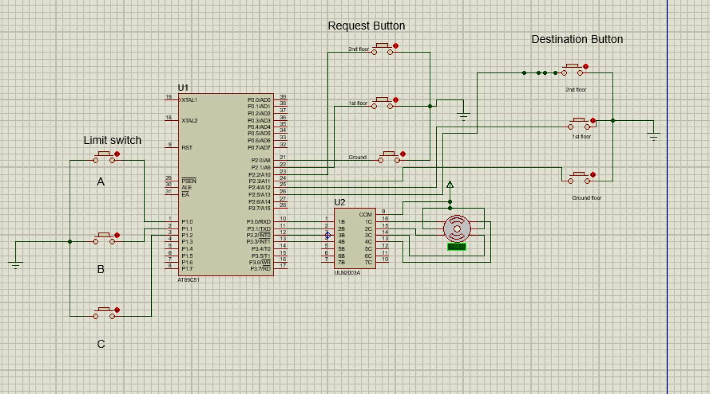
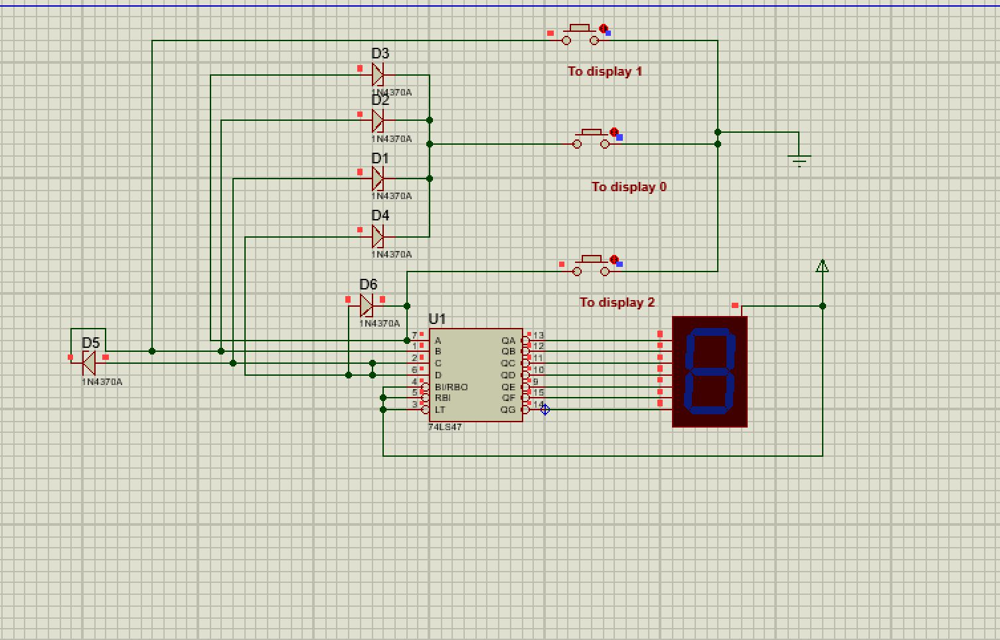

Introduction:
For the particular elevator system a 3 floor elevator was designed. It consists of ground floor , first floor, second floor. when a user presses a floor button , the microcontroller identifies the request and activates the motor driver to move the elevator up and down.

Objectives:
1.To design a fully automatic elevator system using a microcontroller.

2. To control elevator movement between floors using motor direction control.

3.To display the current floor number on a 7 segment display .

4. To improve the reliability and efficiency of elevator operation using microcontroller.

Working explanation:
In this elevator system, the input section consists of sensors and switch signals that provide essential information to the microcontroller. The sensors detect the position of the elevator cabin, such as when the lift reaches each floor or when it touches the limit points. Similarly, switches represent the call buttons pressed by users either inside the cabin or on different floors. These inputs are fed into the microcontroller, which acts as the central processing unit of the system. The microcontroller reads these input signals, decides the direction of movement, and manages the operation of the elevator based on the programmed logic. It then sends output signals to two main components: the 7-segment display and the motor driver (L293D). The 7-segment display shows the current floor number to the user, while the L293D driver amplifies the microcontroller’s signal to operate the elevator motor. The motor receives direction and speed control commands through the driver, allowing the elevator to move up or down smoothly. In this way, the microcontroller processes all input information and controls the output devices to ensure proper movement and display of the elevator system.

